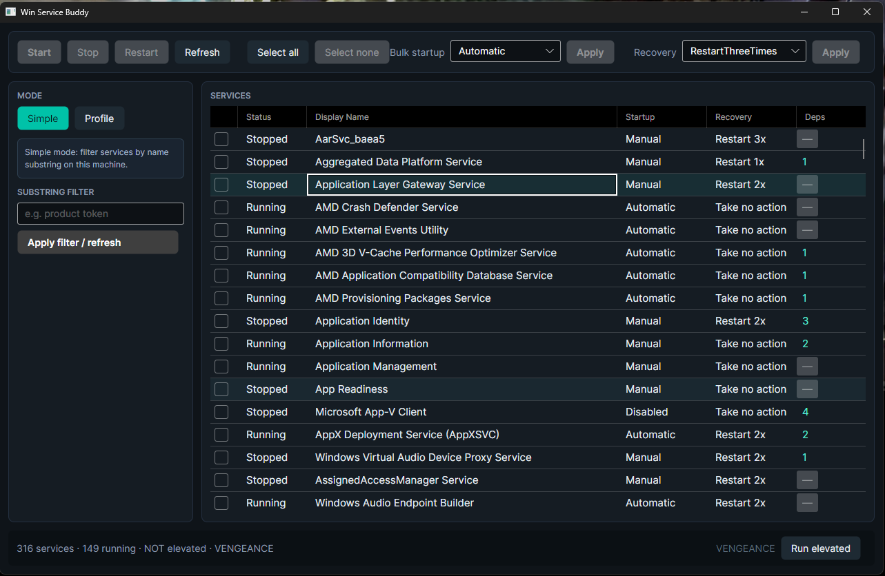
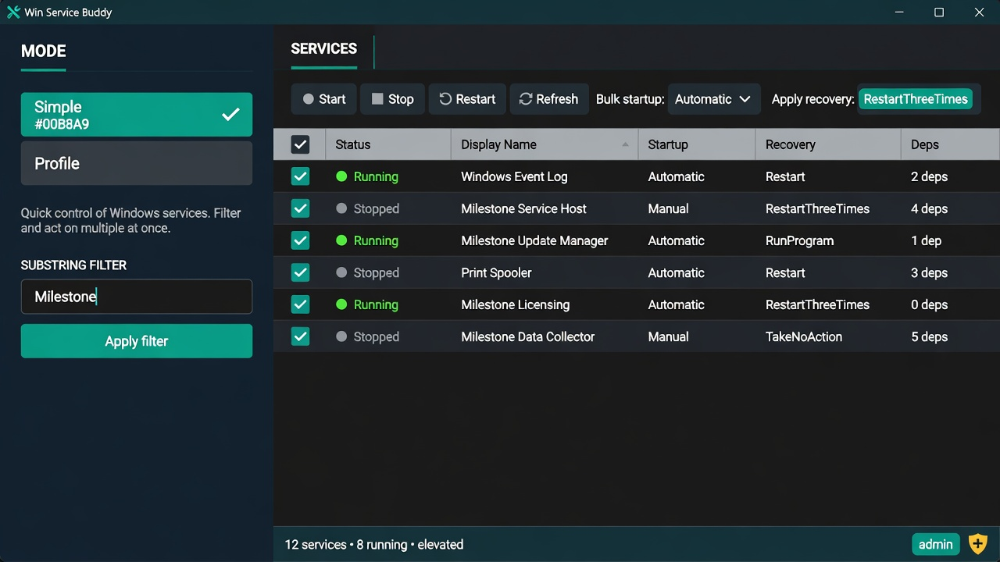
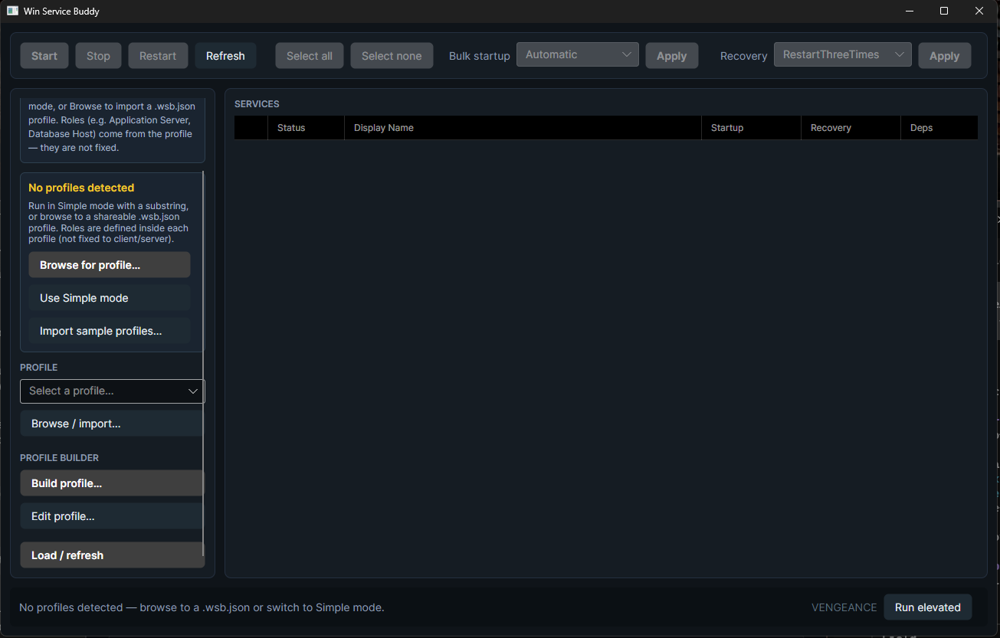
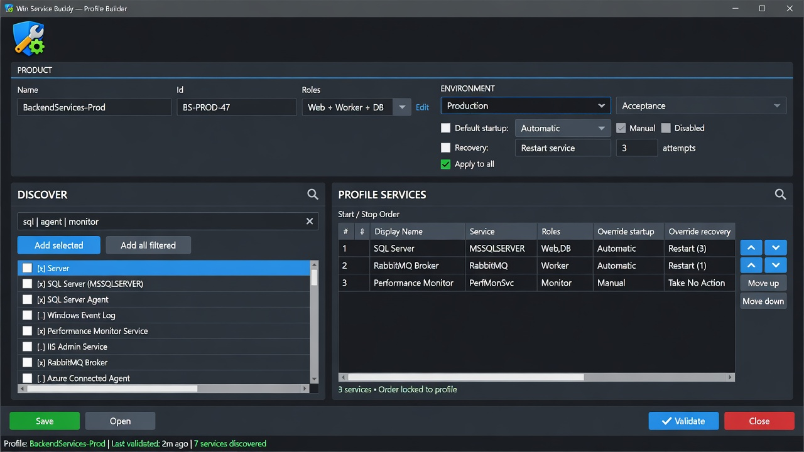
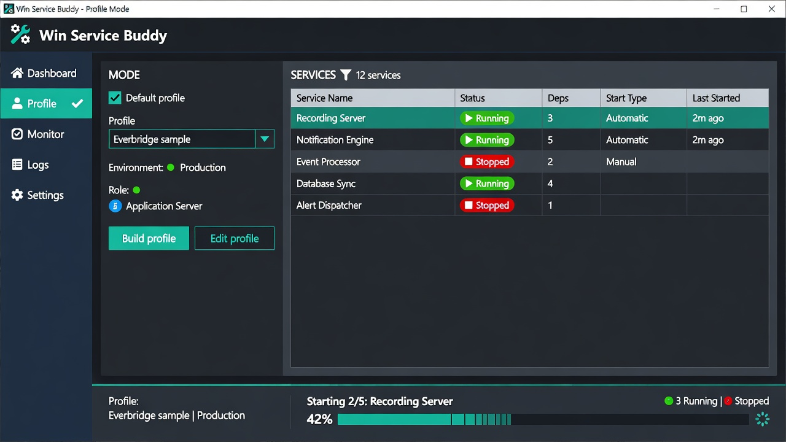

# Win Service Buddy

Windows-native tool for managing **product-scoped** Windows Services—not a generic `services.msc` clone.

Filter related services, load shareable product **profiles** (roles + environments), bulk-edit startup and crash recovery, and author profiles with an in-app **Profile Builder**.

| | |
|---|---|
| **OS** | Windows Server 2012 R2+ · Windows 10/11 |
| **UI** | Avalonia desktop (dark ops console) + CLI |
| **Stack** | .NET (`net10.0-windows`) · self-contained publish recommended |

---

## Screenshots

### Simple mode — filter & manage services

Substring filter (e.g. product name token), multi-select, bulk start/stop/restart, startup type, and recovery presets.



<p align="center"></p>

### Profile mode — product profiles, environments, builder entry

Load a `.wsb.json` profile, pick **environment** (Production / Acceptance) and **role**, set a **default profile** for next launch, or open the Profile Builder.



### Profile Builder — discover, order, environments

Discover services by substring, add them to a product profile, set start/stop order, and define environment policies (e.g. Production = Automatic + restart-3, Acceptance = Manual + none).

<p align="center"></p>

### Operations progress

Start/stop/restart and bulk config show live progress (status text, progress bar, per-row state).

<p align="center"></p>

> Real captures in `docs/screenshots/01-simple-mode.png` and `02-profile-mode.png`. Hero/builder images illustrate the intended UX (layout continues to evolve).

---

## Features

- **Simple mode** — filter services by name/display substring  
- **Profile mode** — shareable `.wsb.json` profiles with:
  - **Roles** (profile-defined: Application Server, Database Host, … — not fixed client/server)
  - **Environments** (Production vs Acceptance desired startup/recovery)
  - **Start/stop order** for product services  
  - Role-scoped **prerequisites** (e.g. MSMQ, SQL, IIS checks from product docs)  
- **Profile Builder** — discover/add services, reorder, env defaults & overrides, save/export  
- **Default profile** — launch directly in Profile mode with your chosen profile  
- **Bulk edits** — Automatic / Manual / Disabled · recovery restart-3 / none  
- **CLI** (`wsbuddy`) — same core library as the GUI  
- **Elevation** — relaunch elevated when needed for service control  

---

## Quick start

### Build & test

```powershell
dotnet build WinServiceBuddy.slnx
dotnet test WinServiceBuddy.slnx
```

### GUI

```powershell
dotnet run --project src/WinServiceBuddy.App
```

- Use **Run elevated** for start/stop/config changes  
- **Profile** mode → **Build profile…** to author a product profile  
- Check **Default profile (open this on launch)** so the next start opens that profile  

### CLI

```powershell
dotnet run --project src/WinServiceBuddy.Cli -- list --substring Spooler
dotnet run --project src/WinServiceBuddy.Cli -- list --profile profiles/examples/multi-tier-abstract-sample.wsb.json --role "Application Server" --environment Production
dotnet run --project src/WinServiceBuddy.Cli -- prereq check --profile profiles/examples/multi-tier-abstract-sample.wsb.json --role "Database Host"
dotnet run --project src/WinServiceBuddy.Cli -- info
```

Mutating commands (`start`, `stop`, `restart`, `set-startup`, `set-recovery`) require an elevated prompt.

---

## Profiles

| Path | Purpose |
|------|---------|
| `profiles/examples/multi-tier-abstract-sample.wsb.json` | Schema v2 sample: roles + Production/Acceptance + ordered services |
| `profiles/examples/substring-template.wsb.json` | Blank template |
| `profiles/examples/*-sample.wsb.json` | Thin substring shells for import testing (not vendor docs) |

**Environments** live inside one product file: same service list and order; different desired startup/recovery.

```text
Product "Milestone XProtect"
  ├─ Environment Production  → Automatic + restart-3
  └─ Environment Acceptance  → Manual + none
```

**Import**

```powershell
dotnet run --project src/WinServiceBuddy.Cli -- profile import profiles/examples/multi-tier-abstract-sample.wsb.json
dotnet run --project src/WinServiceBuddy.Cli -- profile list
```

| Location | |
|----------|--|
| User profiles | `%LocalAppData%\WinServiceBuddy\Profiles` |
| Machine profiles | `%ProgramData%\WinServiceBuddy\Profiles` |
| App settings (default profile) | `%LocalAppData%\WinServiceBuddy\settings.json` |

---

## Solution layout

| Project | Role |
|---------|------|
| `WinServiceBuddy.Core` | SCM, recovery, profiles v2, prereqs, settings |
| `WinServiceBuddy.Cli` | `wsbuddy` CLI |
| `WinServiceBuddy.App` | Avalonia GUI + Profile Builder |
| `WinServiceBuddy.Core.Tests` | Unit tests |

---

## Publish (portable)

```powershell
dotnet publish src/WinServiceBuddy.Cli -c Release -r win-x64 --self-contained true -p:PublishSingleFile=true -o artifacts/cli
dotnet publish src/WinServiceBuddy.App -c Release -r win-x64 --self-contained true -o artifacts/app
```

Packaging planned: portable ZIP, MSI, Chocolatey.

---

## Version

See `Directory.Build.props` (or git tags such as `v0.1.0`).

---

## License

TBD.
