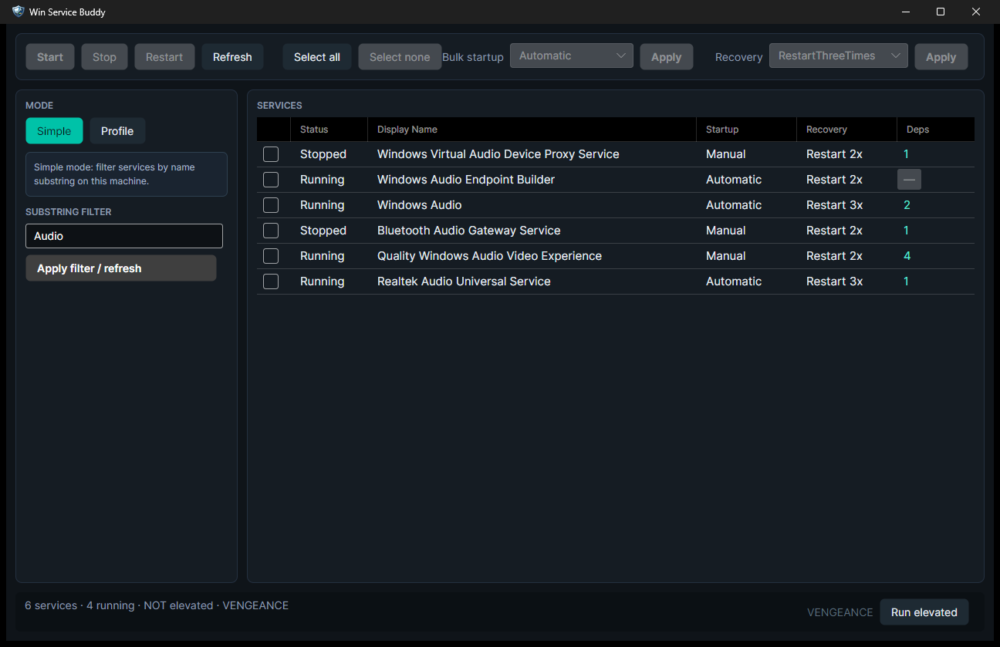
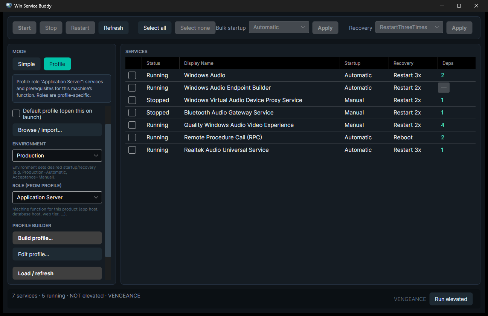

# Win Service Buddy

Windows-native tool for managing **product-scoped** Windows Services—not a generic `services.msc` clone.

Filter related services, load shareable product **profiles** (roles + environments), bulk-edit startup and crash recovery, and author profiles with an in-app **Profile Builder**.

| | |
|---|---|
| **OS** | Windows Server 2012 R2+ · Windows 10/11 |
| **UI** | Avalonia desktop (dark ops console) + CLI |
| **Stack** | .NET (`net10.0-windows`) · self-contained publish recommended |

---

## Install

### Download a release (recommended)

Grab the latest `win-x64` ZIPs from the [**Releases**](https://github.com/kilrkrow/win-service-buddy/releases/latest) page:

| Asset | Contents |
|-------|----------|
| `wsbuddy-app-win-x64-vX.Y.Z.zip` | `WinServiceBuddy.App.exe` — the desktop GUI |
| `wsbuddy-cli-win-x64-vX.Y.Z.zip` | `wsbuddy.exe` — the CLI |

Both are **self-contained**: no .NET runtime install required. Unblock the ZIP (Properties → Unblock) before extracting, then run the EXE. Every release lists SHA256 checksums for its assets.

### Chocolatey

A Chocolatey package (`wsbuddy`) that downloads the release ZIPs lives in [`pack/chocolatey/`](pack/chocolatey/README.md). It is not on the community feed yet, so pack and install it locally:

```powershell
cd pack/chocolatey/wsbuddy
choco pack
choco install wsbuddy -y -s .
```

### Build from source

Requires the **.NET 10 SDK** on Windows — see [Quick start](#quick-start).

---

## Screenshots

### Simple mode

Substring filter, multi-select, bulk start/stop/restart, startup type, recovery presets, and dependency counts.



### Profile mode

First run with no profiles installed: browse/import a `.wsb.json`, or go straight to the Profile Builder via **Build profile…** / **Edit profile…**. Once a profile is selected, **Environment** and **Role** pickers appear below it.



---

## Features

- **Simple mode** — filter services by name/display substring  
- **Profile mode** — shareable `.wsb.json` profiles with:
  - **Roles** (profile-defined: Application Server, Database Host, … — not fixed client/server)
  - **Environments** (Production vs Acceptance desired startup/recovery)
  - **Start/stop order** for product services  
  - Role-scoped **prerequisites** (e.g. MSMQ, SQL, IIS checks from product docs)  
- **Profile Builder** — discover/add services, reorder, env defaults & overrides, save/export  
- **Default profile** — launch directly in Profile mode with your chosen profile  
- **Bulk edits** — Automatic / Automatic (Delayed) / Manual / Disabled · recovery restart-3 / none  
- **CLI** (`wsbuddy`) — same core library as the GUI  
- **Elevation** — relaunch elevated when needed for service control  
- **Progress feedback** — status + progress bar while starting/stopping/configuring  

---

## Quick start

### Build & test

Needs the .NET 10 SDK on Windows (the projects target `net10.0-windows`).

```powershell
dotnet build WinServiceBuddy.slnx
dotnet test WinServiceBuddy.slnx
```

### GUI

```powershell
dotnet run --project src/WinServiceBuddy.App
```

- Use **Run elevated** for start/stop/config changes  
- **Profile** mode → **Build profile…** to author a product profile  
- Check **Default profile (open this on launch)** so the next start opens that profile  
- Press **Enter** in filter fields to apply search  

### CLI

From a release ZIP the binary is `wsbuddy.exe`; from source, prefix with `dotnet run --project src/WinServiceBuddy.Cli --`.

```powershell
wsbuddy list --substring Spooler
wsbuddy status --profile profiles/examples/multi-tier-abstract-sample.wsb.json --role "Application Server" --environment Production
wsbuddy prereq check --profile profiles/examples/multi-tier-abstract-sample.wsb.json --role "Database Host"
wsbuddy info
```

| Command | Does |
|---------|------|
| `list` / `status` | List or show status for matching services |
| `start` / `stop` / `restart` | Lifecycle operations (ordered when a profile is used) |
| `set-startup <automatic\|delayed\|manual\|disabled>` | Bulk startup type |
| `set-recovery <restart-3\|none>` | Bulk crash-recovery preset |
| `prereq check` | Evaluate a profile's prerequisites for a role |
| `profile list\|show\|import\|export\|validate` | Manage `.wsb.json` profiles |
| `elevate` | Relaunch the CLI elevated |
| `info` | Elevation state, user, machine, profile directories |
| `gui` | Launch the desktop app next to the CLI |

Selection options are shared: `--substring/-s`, `--profile/-p`, `--role/-r`, `--environment/-e`. `--json` gives machine-readable output on `list`, `status`, `start`/`stop`/`restart`, `set-startup`, `set-recovery`, and `prereq check`.

Mutating commands (`start`, `stop`, `restart`, `set-startup`, `set-recovery`) require an elevated prompt.

---

## Profiles

| Path | Purpose |
|------|---------|
| `profiles/examples/multi-tier-abstract-sample.wsb.json` | Schema v2 sample: roles + Production/Acceptance + ordered services |
| `profiles/examples/substring-template.wsb.json` | Blank template (set your product token) |

**Environments** live inside one product file: same service list and order; different desired startup/recovery.

```text
Product "Your Product"
  ├─ Environment Production  → Automatic + restart-3
  └─ Environment Acceptance  → Manual + none
```

**Import**

```powershell
dotnet run --project src/WinServiceBuddy.Cli -- profile import profiles/examples/multi-tier-abstract-sample.wsb.json
dotnet run --project src/WinServiceBuddy.Cli -- profile list
```

| Location | |
|----------|--|
| User profiles | `%LocalAppData%\WinServiceBuddy\Profiles` |
| Machine profiles | `%ProgramData%\WinServiceBuddy\Profiles` |
| App settings (default profile) | `%LocalAppData%\WinServiceBuddy\settings.json` |

---

## Solution layout

| Project | Role |
|---------|------|
| `WinServiceBuddy.Core` | SCM, recovery, profiles v2, prereqs, settings |
| `WinServiceBuddy.Cli` | `wsbuddy` CLI |
| `WinServiceBuddy.App` | Avalonia GUI + Profile Builder |
| `WinServiceBuddy.Core.Tests` | Unit tests |

---

## Publish (portable)

Build the self-contained `win-x64` payloads:

```powershell
dotnet publish src/WinServiceBuddy.Cli -c Release -r win-x64 --self-contained true -p:PublishSingleFile=true -p:DebugType=none -o artifacts/cli
dotnet publish src/WinServiceBuddy.App -c Release -r win-x64 --self-contained true -p:DebugType=none -o artifacts/app
```

Then drop debug symbols, add the example profiles and README, and zip with the names used on the Releases page (`$v` comes from `Directory.Build.props`):

```powershell
$v = ([xml](Get-Content Directory.Build.props)).Project.PropertyGroup.Version
foreach ($d in 'artifacts/cli','artifacts/app') {
  Remove-Item "$d/*.pdb" -Force -ErrorAction SilentlyContinue   # native libSkiaSharp.pdb alone is ~84 MB
  Copy-Item README.md $d
  Copy-Item profiles/examples $d/profiles -Recurse -Force
}
Compress-Archive -Path artifacts/cli/* -DestinationPath "artifacts/wsbuddy-cli-win-x64-v$v.zip" -Force
Compress-Archive -Path artifacts/app/* -DestinationPath "artifacts/wsbuddy-app-win-x64-v$v.zip" -Force
Get-FileHash artifacts/*.zip -Algorithm SHA256 | Format-List
```

`-p:DebugType=none` suppresses the managed `.pdb` files; the native SkiaSharp/HarfBuzz ones ship from NuGet and have to be deleted, which is most of the difference between a ~76 MB and a ~50 MB GUI ZIP.

Packaging: portable ZIP and Chocolatey (see [`pack/chocolatey/`](pack/chocolatey/README.md)) are in place; MSI is still planned.

---

## Version

The current version lives in `Directory.Build.props`; shipped versions are the `vX.Y.Z` git tags and the [Releases](https://github.com/kilrkrow/win-service-buddy/releases) page.

Bumping a release means updating `Directory.Build.props` **and** the pinned version/checksums under `pack/chocolatey/wsbuddy/` — see that package's [README](pack/chocolatey/README.md).

---

## License

No license file yet — all rights reserved until one is added.
